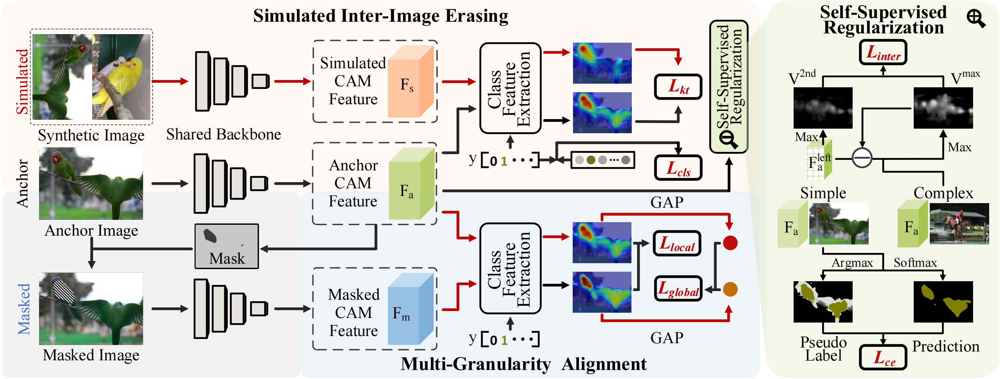

# Knowledge Transfer with Simulated Inter-Image Erasing for Weakly Supervised Semantic Segmentation


Network Architecture
--------------------
The architecture of our proposed approach is as follows



## Prerequisite
* Tested on Ubuntu 18.04, with Python 3.8, PyTorch 1.8.2, CUDA 11.3.

* You can create conda environment with the provided yaml file.
```
conda env create -f wsss_new.yaml
```
* Download [The PASCAL VOC 2012 development kit](http://host.robots.ox.ac.uk/pascal/VOC/voc2012/):
and put it under ./data/ folder.

### Test KTSE
* Download our pretrained weight [039net_main.pth](https://ktse.oss-cn-shanghai.aliyuncs.com/039net_main.pth) (PASCAL, seed: 67% mIoU) and put it under ./experiments/ktse1/ckpt/ folder.
```
python infer.py --name ktse1 --model ktse --load_epo 39 --dict  --infer_list voc12/train_aug.txt
```
```
python evaluation.py --name ktse1 --task cam --dict_dir dict
```


### Train KTSE
* Download the initial weights pretrained on Imagenet [ilsvrc-cls_rna-a1_cls1000_ep-0001.params](https://ktse.oss-cn-shanghai.aliyuncs.com/ilsvrc-cls_rna-a1_cls1000_ep-0001.params) and put it under ./pretrained/ folder.
* Please specify the name of your experiment (e.g., ktse1).
```
python train.py --name ktse1 --model ktse
```


## Second stage training or testing for the segmentation network BECO


### Testing the segmentation results with our pretrained model directly

#### Prerequisite for the segmentation task
* Install Python 3.8, PyTorch 1.11.0, and more in requirements.txt

* Download ImageNet pretrained [model](https://download.pytorch.org/models/resnet101-cd907fc2.pth) of DeeplabV2 from [pytorch](https://pytorch.org/) . Rename the downloaded pth as "resnet-101_v2.pth" and put it into the directory './data/model_zoo/'. (This step is just to avoid directory related error.)


* Download our generated pseudo label [sem_seg](https://ktse.oss-cn-shanghai.aliyuncs.com/sem_seg.zip) and put it into the directory './data/'.  (This step is just to avoid directory related error.)

* Download our pretrained checkpoint [best_ckpt_KTSE_73.0.pth](https://ktse.oss-cn-shanghai.aliyuncs.com/best_ckpt_KTSE_73.0.pth) and put it into the directory './segmentation/'.  Test the segmentation network (you need to install CRF python library (pydensecrf) if you want to test with the CRF post-processing)


```
cd segmentation
pip install -r requirements.txt 

python main.py --test --logging_tag seg_result --ckpt best_ckpt_KTSE_73.0.pth
python test.py --crf --logits_dir ./data/logging/seg_result/logits_msc --mode "val"
```


### Refine the seed for pseudo label with IRN
* Put the downloaded pretrained weight [039net_main.pth](https://ktse.oss-cn-shanghai.aliyuncs.com/039net_main.pth) into the ./irn/sess/ directory.
* Run run_sample.py (You can either mannually edit the file, or specify commandline arguments.) and gen_mask.py to obtain the pseudo-labels and confidence masks (put them into the directory './segmentation/data/' ). Our generated ones can also be downloaded from [sem_seg](https://ktse.oss-cn-shanghai.aliyuncs.com/sem_seg.zip) and [mask_irn](https://ktse.oss-cn-shanghai.aliyuncs.com/mask_irn.zip) .
```
cd irn 
python run_sample.py
python gen_mask.py
```

### Training the segmentation network


#### Prepare the data directory
* Put the data and pretrained model in the corresponding directories like:
```
data/
    --- VOC2012/
        --- Annotations/
        --- ImageSet/
        --- JPEGImages/
        --- SegmentationClass/
        --- ...
    --- sem_seg/
        --- ****.png
        --- ****.png
    --- mask_irn/
        --- ****.png
        --- ****.png
    --- model_zoo/
        --- resnet-101_v2.pth
    --- logging/
```


* Train the segmentation network
```
cd segmentation
python main.py -dist --logging_tag seg_result --amp
```


## Acknowledgements
This code is heavily borrowed from [AEFT](https://github.com/KAIST-vilab/AEFT), [IRN](https://github.com/jiwoon-ahn/irn) and [BECO](https://github.com/ShenghaiRong/BECO).


## Citation

If you find this useful in your research, please consider citing:

    @article{chen2024knowledge,
	title={Knowledge Transfer with Simulated Inter-Image Erasing for Weakly Supervised Semantic Segmentation},
	author={Chen, Tao and Jiang, Xiruo and Pei, Gensheng and Sun, Zeren and Wang, Yucheng and Yao, Yazhou},
	journal={European Conference on Computer Vision (ECCV)},
	year={2024}
	}


